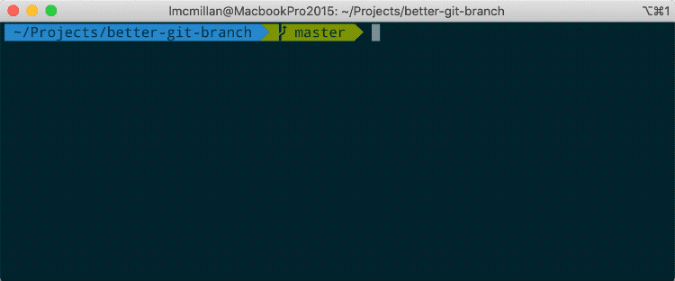

# Better Git Branch

Quickly see and change branches in your repo.



## Installing

```
brew tap lachlanmcmillan/better-git-branch
brew install better-git-branch
```

**Make an alias**

zsh users
```
echo 'alias gb="better-git-branch"' >> ~/.zshrc; source ~/.zshrc;
```
bash users
```
echo 'alias gb="better-git-branch"' >> ~/.profile; source ~/.profile;
```

## Usage

```
$  better-git-branch
```
or, if you've made the alias
```
$  gb
```

- Up/Down arrows - navigate the list
- Enter - checkout branch
- Q - exit

## Building

```
cargo build --release
```

## Roadmap

- [x] show options at the bottom of the screen
- [x] try making the bottom options different colours
- [x] display the result of the delete in the command bar
- [ ] command-line arguments (-a, -r, -v, --help)
- [ ] add other related branch actions (new, rename)
