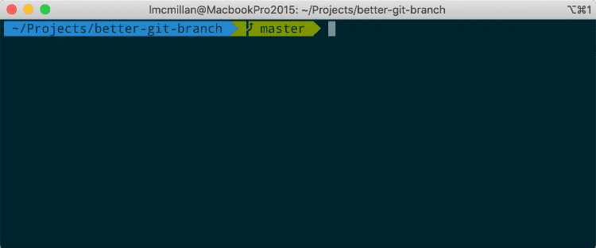

# Better Git Branch

Interactive TUI for navigating and managing git branches.



## Installing

Requires [Bun](https://bun.sh) >= 1.0.0.

```
bun add -g better-git-branch
```

**Make an alias**

zsh users
```
echo 'alias gb="better-git-branch"' >> ~/.zshrc; source ~/.zshrc;
```

bash users
```
echo 'alias gb="better-git-branch"' >> ~/.profile; source ~/.profile;
```

## Usage

```
$ better-git-branch
```
or, if you've made the alias
```
$ gb
```

### Keybindings

| Key    | Action                                   |
|--------|------------------------------------------|
| ↑/↓    | Navigate the list                        |
| Enter  | Checkout branch                          |
| Ctrl+A | Toggle action menu                       |
| Ctrl+S | Toggle sort (recent first / alphabetical) |
| Esc    | Exit (or cancel action menu)             |

### Action menu

| Key     | Action              |
|---------|---------------------|
| D       | Delete branch       |
| Shift+D | Force delete branch |
| Esc     | Cancel              |

### Branch indicators

| Symbol    | Meaning                      |
|-----------|------------------------------|
| (CURRENT) | Currently checked out branch |
| M         | Branch has been merged       |
